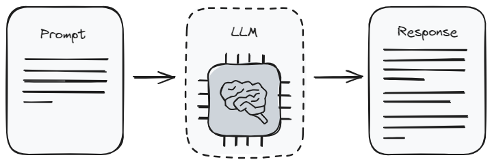
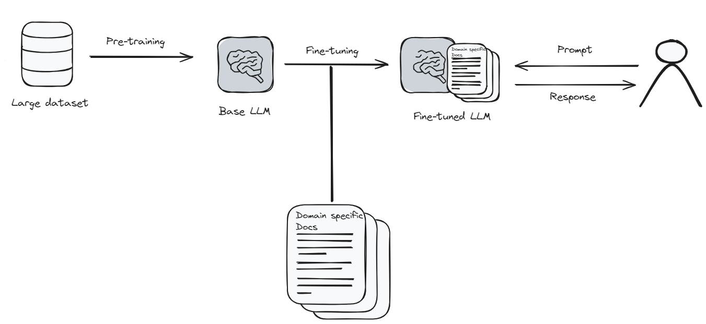
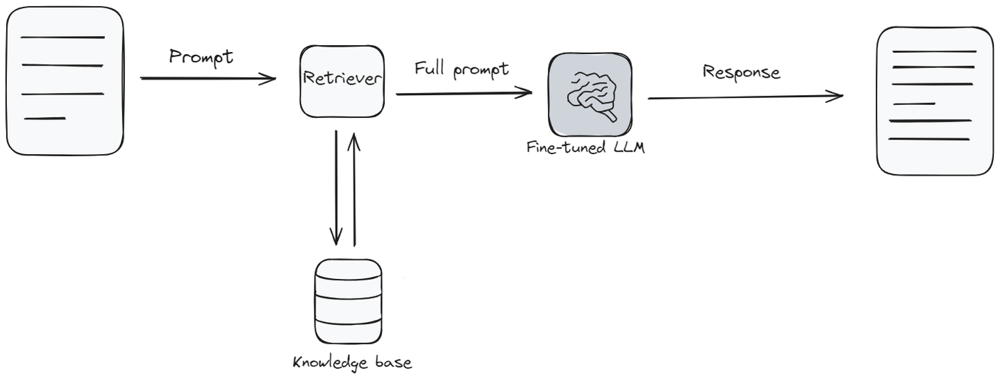

**Fine** **tuning**

Fine-tuning is a process that involves taking a pre-trained model and adjusting it to better fit specific data, thereby enhancing the model's performance. In deep learning fine-tuning is a form of transfer learning, wherein a model trained on a large dataset for a general task, such as image recognition or natural language understanding, is repurposed for a related task through minor adjustments to its internal parameters. The primary goal of this process is to optimize the model’s performance on the new task without starting the training process from scratch.

**When** **to** **fine-tune**

Fine-tuning is especially useful when there is a limited amount of data available and the goal is to enhance the performance of a model. By starting with a pre-trained model, one can utilize the knowledge it has already gained and adjust it to better fit specific data. This method not only improves the model's performance but also reduces the amount of data needed for effective training.

In contrast, when there is a large dataset, fine-tuning may not be necessary, as training a model from scratch can achieve good results without additional adjustments.However fine-tuning can still be beneficial if there is a need to further optimize performance or if the task differs significantly from what the pre-trained model was originally designed for.

**Model** **fine** **tuning** **process**

The fine-tuning procedure is a critical phase in adapting a pre-trained language model to excel in a specific task. This process can be broken down into several key stages, each of which plays a vital role in enhancing the model's performance.

<!--  -->

Below is adetailed overview of the fine-tuning process:

● Dataset Preprocessing:The first step involves preparing the dataset for fine-tuning. This includes cleaning the data, splitting it into training, validation, and test sets, and ensuring compatibility with the model. Proper data preparation is essential, as it lays the groundwork for effective model training.

● Model Initialization:The process begins with a pre-trained language model, such as GPT-3 or GPT-4. This model is initialized with its pre-trained weights, which encapsulate a vast amount of knowledge acquired from diverse text sources.This foundation provides a powerful starting point for the fine-tuning process.

● Task-Specific Architecture:To tailor the model for a specific task, adjustments to its architecture may be necessary. This can involve adding task-specific layers or modifying existing ones, enabling the model to specialize while retaining its general language understanding capabilities from pre-training.

● Training:With the modified architecture in place, the model is trained on the task-specific  dataset. During this phase, the model's weights are updated using backpropagation and gradient descent. The model learns to identify task-specific patterns and relationships within the dataset.

● Hyperparameter Tuning:Fine-tuning requires careful adjustment of hyperparameters, such as learning rate, batch size, and regularization strength.Optimizing these parameters is crucial for effective learning and helps ensure that the model generalizes well to new data without overfitting.

● Validation:Throughout the training process, the model's performance is monitored using a separate validation dataset. This step assesses how well the model is learning the task and identifies potential overfitting. Adjustments can be made based on validation results to enhance performance.

● Testing:Once training is complete, the model is evaluated on a distinct test dataset that it has not encountered before. This unbiased assessment measures the model's performance and its ability to handle new, unseen data, ensuring reliability in real-world applications.

● Iterative Process:Fine-tuning is often an iterative endeavor. Based on the results from validation and testing, further adjustments may be necessary regarding the model's architecture, hyperparameters, or training data to enhance performance.

● Early Stopping:Implementing early stopping mechanisms is vital to prevent overfitting. If the model's performance on the validation set plateaus or declines, training can be halted to avoid unnecessary overfitting. This approach conserves computational resources and maintains the model's generalization ability.

● Deployment:After successful validation and testing, the fine-tuned model is ready for deployment. It can be integrated into software systems or services for various applications, including text generation, question answering, or recommendations.

#
**Prominent** **Fine-Tuning** **Methods**

Several fine-tuning techniques are employed to adjust model parameters for specific tasks, broadly categorized into two main approaches: supervised fine-tuning and reinforcement learning from human feedback (RLHF).

**A.** **Supervised** **Fine-Tuning**

In supervised fine-tuning, a model is trained on a labeled dataset where each input is paired with a correct output. This method enables the model to leverage its pre-existing knowledge from pre-training and significantly enhances its performance on specific tasks. Key techniques include:

● Basic Hyperparameter Tuning: Involves manually adjusting hyperparameters (e.g., learning rate, batch size) to optimize model performance, balancing learning speed and overfitting risk.

● Transfer Learning:Utilizes a pre-trained model as a foundation, which is then fine-tuned on task-specific data. This technique reduces training time and data requirements while improving performance.

● Multi-Task Learning: Involves training the model on multiple related tasks simultaneously, allowing it to generalize better across tasks and improve overall performance.

● Few-Shot Learning: Enables the model to adapt to new tasks with minimal data, leveraging its extensive pre-training knowledge to learn from just a few examples.

● Task-Specific Fine-Tuning:Focuses on optimizing the model for a specific task, ensuring it excels in generating relevant outputs tailored to that domain.

**B.** **Reinforcement** **Learning** **from** **Human** **Feedback**
**(RLHF)**

RLHF is an innovative approach that enhances language models through human feedback, facilitating continuous improvement in response accuracy and appropriateness. Common techniques include:

● Reward Modeling:  Human evaluators rank model outputs, and the model learns to maximize predicted rewards based on this feedback, enhancing its ability to perform complex tasks.

● Proximal Policy Optimization (PPO): An iterative algorithm that updates the model's policy to maximize expected rewards while preventing drastic changes, ensuring stability and efficiency.

● Comparative Ranking:  The model learns from relative rankings of outputs instead of absolute evaluations, offering nuanced feedback that aids in understanding the complexities of the task better.

● Preference Learning: This technique involves human evaluators expressing preferences between pairs of outputs, allowing the model to adjust its behavior based on these insights.

● Parameter-Efficient Fine-Tuning (PEFT):  Focuses on improving model performance by updating only a small subset of parameters during fine-tuning, significantly reducing computational and storage requirements while maintaining efficacy.
#

**RAG** **vs.** **Fine-Tuning** **vs.** **Prompt** **Engineering**

Large Language Models (LLMs) have revolutionized various domains, but they come with limitations, primarily due to their reliance on static training data. This can lead to outdated information and inaccuracies, often referred to as AI hallucinations, which may negatively impact business decisions.

To address these challenges, three primary methods have emerged:

**Prompt** **Engineering**

Prompt engineering is the foundational method for interacting with Large Language Models (LLMs). It involves crafting prompts to instruct the model on the desired information. While straightforward and accessible, it has limitations due to the model's reliance on its pre-existing training data.

**Pros:**

● Ease of Use: User-friendly and requires no advanced technical skills.

● Cost-Effectiveness: Minimal computational costs as it utilizes pre-trained models.

● Flexibility: Prompts can be quickly adjusted to explore various outputs.

**Cons**

● Inconsistency: The quality and relevance of the model's responses can vary significantly based on the phrasing of the prompt.

● Limited Customization: The ability to tailor the model's responses is restricted to the creativity and skill in crafting effective prompts.

● Dependence on Model's Knowledge: The outputs are limited to what the model has learned during its initial training, making it less effective for highly specialized or up-to-date information.

Figure 1: Prompt Engineering Process

**Fine-Tuning**

Fine-tuning involves updating a language model to specialize in a specific area, akin to enhancing an app's features. This process requires significant computational resources and time but results in a model that delivers more accurate and relevant responses.

**Pros:**

● Customization: Enables extensive tailoring for specific domains or styles.

● Improved Accuracy: Produces more precise responses through specialized training.

● Adaptability: Better handles niche topics and recent information.

**Cons:**

● Cost: Requires substantial computational resources, making it expensive.

● Technical Skills: Necessitates a deeper understanding of machine learning.

● Data Requirements: Needs a well-curated dataset for effective training.

Figure 2: Fine-Tuning Process

**Retrieval** **Augmented** **Generation** **(RAG)**

Retrieval Augmented Generation (RAG) combines LLMs with a knowledge base. The model retrieves relevant information before generating responses, ensuring answers are current and detailed. RAG strikes a balance between ease of use and customization.

**Pros:**

● Dynamic Information: Provides up-to-date and relevant information.

● Balance: Offers a middle ground between prompting and fine-tuning.

● Contextual Relevance: Enhances responses with additional context.

**Cons:**

● Complexity: Integration between the model and retrieval system can be complex.

● Resource Intensive: Requires considerable computational power.

● Data Dependency: Output quality relies heavily on the accuracy of retrieved information.

Figure 3: RAG (Retrieval-Augmented Generation) Process
#

**Challenges** **and** **Limitations** **of** **LLM** **Fine-Tuning**

● Overfitting: Fine-tuning can lead to overfitting, where the model becomes too specialized on the training data, resulting in poor performance on unseen data, especially with small or unrepresentative datasets.

● Catastrophic Forgetting: The model may lose previously acquired general knowledge during fine-tuning, impairing its ability to adapt to diverse tasks.

● Bias Amplification: Fine-tuning can inadvertently amplify biases present in pre-trained models, leading to biased predictions and raising ethical concerns.

● Generalization Challenges: Ensuring effective generalization across various inputs is difficult, a model may excel on fine-tuning datasets but struggle with out-of-distribution data.

● Data Requirements: Fine-tuning requires high-quality, task-specific labeled data, which may be scarce or noisy, negatively impacting performance.

● Hyperparameter Tuning Complexity: Selecting appropriate hyperparameters for fine-tuning is complex and can be time-consuming, with poor choices leading to slow convergence or suboptimal results.

● Domain Shift Sensitivity: Fine-tuning on data significantly different from pre-training data can cause domain shift issues, often requiring domain daptation techniques.

● Ethical Considerations: Fine-tuned models may generate harmful or inappropriate content, necessitating ongoing efforts to ensure ethical behavior and safety.

● Resource Intensiveness: Fine-tuning large models demands substantial computational resources and time, posing challenges for smaller teams or organizations.

● Unintended Outputs: There is no guarantee that fine-tuning will produce consistently correct outputs models may generate plausible but factually incorrect responses, requiring careful validation.

● Model Drift: Over time, a fine-tuned model's performance may deteriorate due to changes in data distribution, necessitating regular monitoring and re-fine-tuning to maintain optimal performance.

#

**Fine-Tuning** **Applications**

Fine-tuning pre-trained models offers a wealth of benefits across various applications, enhancing their effectiveness and relevance in real-world scenarios:

**a.** **Sentiment** **Analysis**

Fine-tuned models are particularly adept at analyzing sentiments expressed in customer feedback and social media interactions. By leveraging these models, organizations can gain deep insights into public perception and customer satisfaction. This capability not only aids in understanding consumer sentiments but also empowers businesses to make data-driven decisions that enhance their products and services.

**b.** **Chatbots**

The enhancement of chatbot interactions through fine-tuning is another significant application. By tailoring models to specific industries or domains, businesses can create chatbots that provide more relevant and personalized assistance. This customization leads to improved customer engagement, as users receive responses that are not only accurate but also contextually appropriate. 

**c.** **Summarization**

In an age where information overload is common, the ability to automatically generate concise summaries of lengthy documents is invaluable. Fine-tuned models excel in this area, enabling organizations to distill essential information from extensive reports, articles, or research papers. This functionality significantly aids in information retrieval, allowing users to quickly grasp key points without wading through unnecessary details

#

**Future** **Trends** **in** **Fine-Tuning** **Large** **Language**
**Models**

Fine-tuning large language models (LLMs) is an evolving process influenced by advancements in natural language processing (NLP). Here are some promising future trends:

**1.** **Scalability**

As the demand for larger models grows, efficiently training and fine-tuning these systems presents significant challenges related to data volume and computational resources. Researchers are actively exploring various strategies to address these issues:

● Data Augmentation: Generating diverse data from existing sources.

● Data Compression: Reducing data size while retaining essential information.

● Model Compression: Minimizing model size without sacrificing performance.

● Parallelism Techniques: Implementing model, data, and pipeline parallelism to distribute workloads.

● Federated Learning: Training on decentralized datasets to enhance privacy and efficiency.

● Neural Architecture Search: Identifying optimal model architectures for specific tasks.

**2.** **Interpretability**

Understanding the decision-making processes of models is crucial for building trust and enhancing performance. Innovative techniques are being developed to improve interpretability:

● Attention Visualization: Analyzing attention weights to understand model focus.

● Feature Attribution: Linking predictions to specific input features.

● Counterfactual Analysis: Comparing predictions by altering input aspects.

● Explanation Generation: Creating natural language explanations for outputs.

● Explanation Evaluation: Assessing the quality of generated explanations.

**3.** **Generalization**

Improving the ability of models to generalize knowledge across new domains and tasks is critical for their practical application. Effective strategies include:

● Multi-Task Learning: Training on multiple tasks simultaneously to improve adaptability.

● Meta-Learning: Teaching models to learn quickly from new tasks.

● Domain Adaptation: Adjusting models to new domains with minimal supervision.

● Zero-Shot Learning: Enabling models to perform tasks without labeled data.

● Few-Shot Learning: Allowing models to learn from a limited number of examples.

● Self-Supervised Learning: Utilizing unlabeled data to generate its own supervision.

**References**

●[<u>https://www.lakera.ai/blog/llm-fine-tuning-guide</u>](https://www.lakera.ai/blog/llm-fine-tuning-guide)

●[<u>https://myscale.com/blog/prompt-engineering-vs-finetuning-vs-rag/</u>](https://myscale.com/blog/prompt-engineering-vs-finetuning-vs-rag/)

●[<u>https://gpttutorpro.com/fine-tuning-large-language-models-future-trends-and-challenges/</u>](https://gpttutorpro.com/fine-tuning-large-language-models-future-trends-and-challenges/)

●[<u>https://www.turing.com/resources/finetuning-large-language-models</u>](https://www.turing.com/resources/finetuning-large-language-models)

●[<u>https://www.techtarget.com/searchenterpriseai/definition/fine-tuning</u>](https://www.techtarget.com/searchenterpriseai/definition/fine-tuning)
